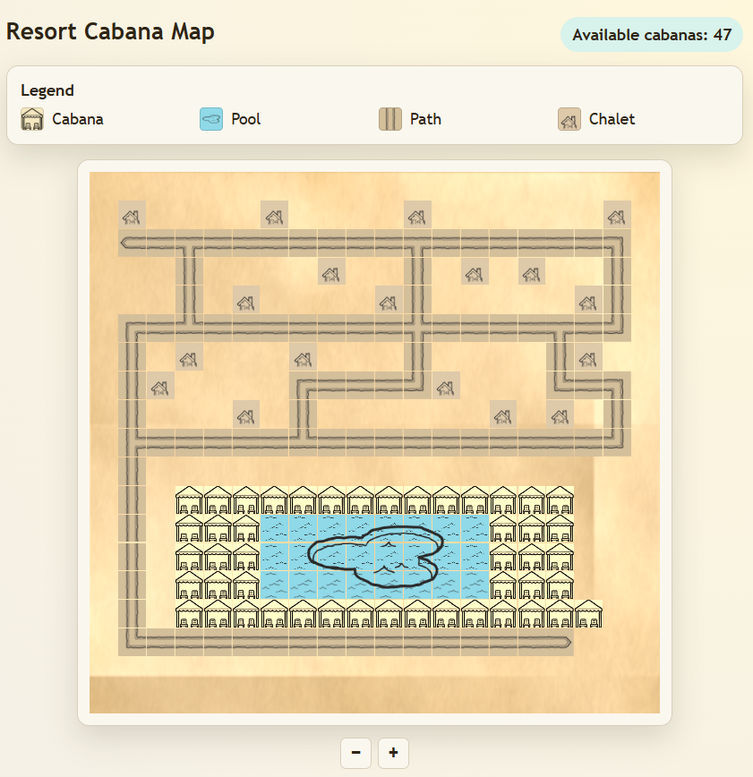

# Resort Map

Interactive resort cabana booking app with a TypeScript/Express backend and React frontend.

## Tech Stack

- Backend: Node.js + TypeScript + Express
- Frontend: React + TypeScript + Vite
- Testing: Vitest + Testing Library

## Requirements

- Node.js 18+ (Node.js 20+ recommended)
- npm

## Install

From the project root:

```bash
npm install
```

## Run the app (single entrypoint)

This command starts both backend and frontend from the repository root:

```bash
npm run start
```

Default URLs:

- Frontend: `http://127.0.0.1:5173`
- Backend API: `http://127.0.0.1:3000`

### Custom input files

The single entrypoint accepts forwarded CLI options:

```bash
npm run start -- --map ./map.ascii --bookings ./bookings.json
```

If omitted, defaults are:

- `map.ascii`
- `bookings.json`

## Test commands

Run frontend tests:

```bash
npm run test:web
```

Run backend tests:

```bash
npm run test:server
```

Watch mode:

```bash
npm run test:web:watch
npm run test:server:watch
```

## API Overview

- `GET /api/health` - service health check
- `GET /api/map` - full map payload with cabana availability
- `POST /api/cabanas/:id/book` - book a cabana with `{ roomNumber, guestName }`

## Design decisions and trade-offs

The backend keeps booking state in memory to keep the solution simple and focused on the coding task. This means bookings reset when the process restarts. The frontend uses a pull-based REST integration (reload map after successful booking), which is straightforward but does not provide cross-client real-time updates without adding polling/WebSockets. Styling is plain CSS for low tooling overhead and readability, at the cost of fewer utility abstractions. Form validation is intentionally lightweight for the small booking form and delegated to backend rules for final validation. Rate limiting is intentionally not implemented for this exercise; in production, the booking endpoint should be protected with per-IP/per-session throttling to reduce brute-force and abuse risk.

## Screenshot

Running map view screenshot:



## AI workflow notes

AI-assisted workflow details are documented in `AI.md`.
